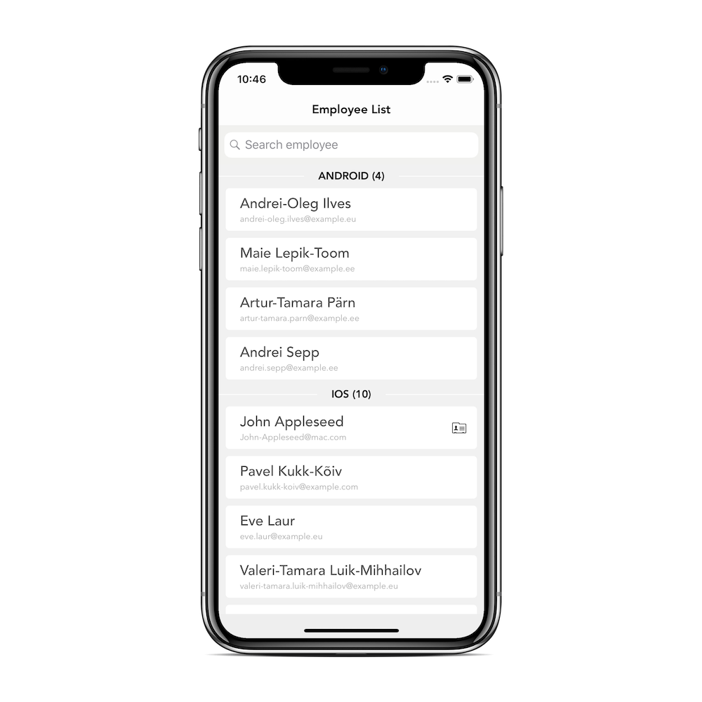

# Employee Directory

  

This application displays a list of employees from a remote server along with their details. If an employee exists in the phone contacts database, app open up the native contacts display form as well.

This application has following functionality implemented

##### Employee List

###### Mandatory

* Fetching employee list from the server.

* List of employee are grouped by position. Groups are sorted alphabetically, employees are sorted by last name. Each employee is unique by their full name (first name + last name) and is displayed only once in the list view.

* Pull-to-refresh to update the data from the servers

* Error handling and alert using appropriate error message

* Fetching the phone’s built-in contacts and match them against the list of employees. If the employee has a matching contact in the phone (first and last names are a case-insensitive match), the list element should display a button. If user presse that button then app  displays the iOS native Contact detail view.

###### Non Mandatory

* Search by firstname, lastname, email and position.

##### Employee Detail

* Displays a detailed view of the employee’s information that are selected from employee list view.

### How run and build the application?

Clone or download this repository in your local machine and open ****EmployeeDirectory.xcodeproj**** file. Select whatever simulator you want to open with your app and run it.

### Used Architecture

##### MVVM(Model-View-ViewModel)

Choosing app architecture is the most important part of the app development process. A good architecture makes the app more reliable and easy to maintain in the long run. Here in this application, I choose MVVM architecture because it's more reliable and easy to maintain. MVVM separates the business logic from the presentation layer so it is easy to solve the complex bugs and issues easily.

### Authors

* Sagar Unagar ([Twitter](https://twitter.com/SagarUnagar_), [LikedIn](https://www.linkedin.com/in/sdunagar))
